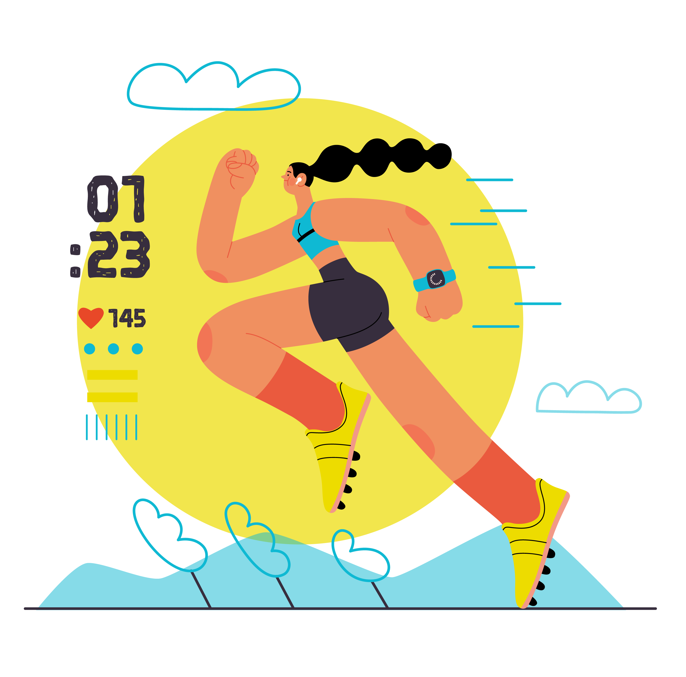

<a name="readme-top"></a>

<!-- PROJECT LOGO -->
<br />
<div align="center">
  <a href="https://gitlab.prodigious.com/Prodigious/top-gun-academy/pgd-sports-news">
    
  </a>

<h3 align="center">Sports News Site</h3>

  <p align="center">
    A simple site for sports news.
    <br />
  </p>
</div>

<!-- ABOUT THE PROJECT -->

## About The Project

[![Product Name Screen Shot][product-screenshot]](https://pending)

This is a website focused in sports where PGDers can create, edit and update news and posts related to sports. All sports are allowed and they can be organized by categories created by the user. The user can see images, tournaments results and statistics. The main idea is to create a community over sports in PGD.


<p align="right">(<a href="#readme-top">back to top</a>)</p>

### Built With

<a href="https://vuejs.org" target="_blank">
  
</a>
<a href="https://strapi.io/" target="_blank">
  
</a>

<p align="right">(<a href="#readme-top">back to top</a>)</p>

<!-- GETTING STARTED -->

### Installation

1. Go into folder

   ```sh
   cd pgd-sports-news
   ```

3. Install NPM packages

   ```sh
   npm install
   ```

4. This proyect require the insatll of Strapi CMS provided in the folder *pgd-sports-news-cms*

    ```sh
    cd pgd-sports-news-cms && npm install
    ```

5. For run the Strapi CMS

    ```sh
    npm run serve:strapi:dev
    ```

6. Execute npm run serve to launch the application

    ```sh
    npm run serve
    ```

<p align="right">(<a href="#readme-top">back to top</a>)</p>

## Versions
